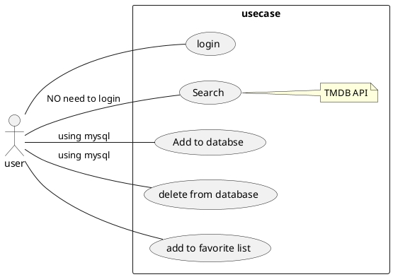
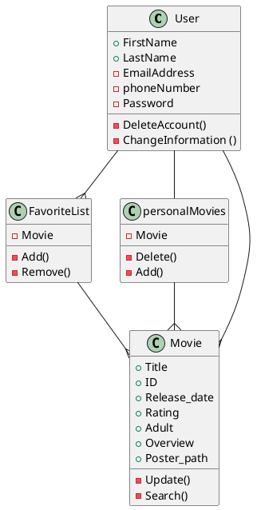

# Information about the Author
* Jaber Askari
* M2947
* TTV18S3
* User Interface Course

# General Description about the Application
In this project I am planning to make a movie database application. Name of the application is MyMDB. 
MyMDB is application that a user can search for movies, save movies informations in his/her own database using Mysql. User also can add a movie and delete a movie from his/her 
own database. In additon,t application uses the TMDB API to fetch movie's information from the TMDB website each time the application opens or user search for something. 
Adding a movie or deleting a movie from Mysql database is restricted to users who have an account in the application. Application can be used with out having an account but 
user can only search for movies from the TMDB and see popular movies not anything else.

# For what audience is it made
The application is meant for personal use generally. Users with out an account in the application can use the application for searching and getting information about movies, in
this case the information is fetched from the TMDB website. If the user makes an account in the application, user can save the information of his/her personal movies in the server of
the application. Users with account can save, add, remove and search movies from his/her own personal movie database.

# Operation Environment and Technology
MyMDB is a windows application which is  made with C# programming language using WPF system. In the coding of the application MVVM, TMDB's Api and Mysql has been used.

# Identifying different Actors
Actors for the application are:
* User
* OMDB website
* Mysql Database

# List of Features to be implemented, Features are shown from end-user's point of view
* User can use the application for getting information (search) about movies without having an account in the. Application will get information from TMDB website.
* User can make an account and  enjoy saving his/her own personal movies in the application database. 
* User when logged in his account, he/she is able to add/delete movies to/from his/her own personal database. 
* User with account in the application can add movies in his/her favorite list.

# Features UML, Use Case(Actors, features)

# Class Diagram

# Work Share 
This project has been entirely done alone by me.

# Time planning
🔖 Työaikasuunnitelma (mitä aiotaan tehdään ja minä päivänä/viikkona, suunnitellut resurssit), kerää toteuma päivittäin/viikottain, esitä suunnitelmassa muutama tuleva viikko. Pohdi kuitenkin kokonaisuutta.